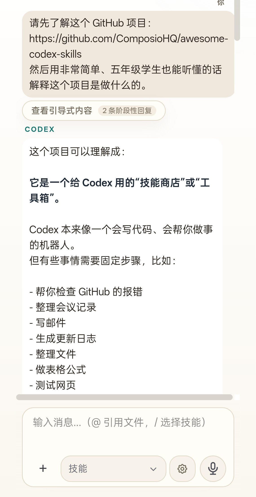
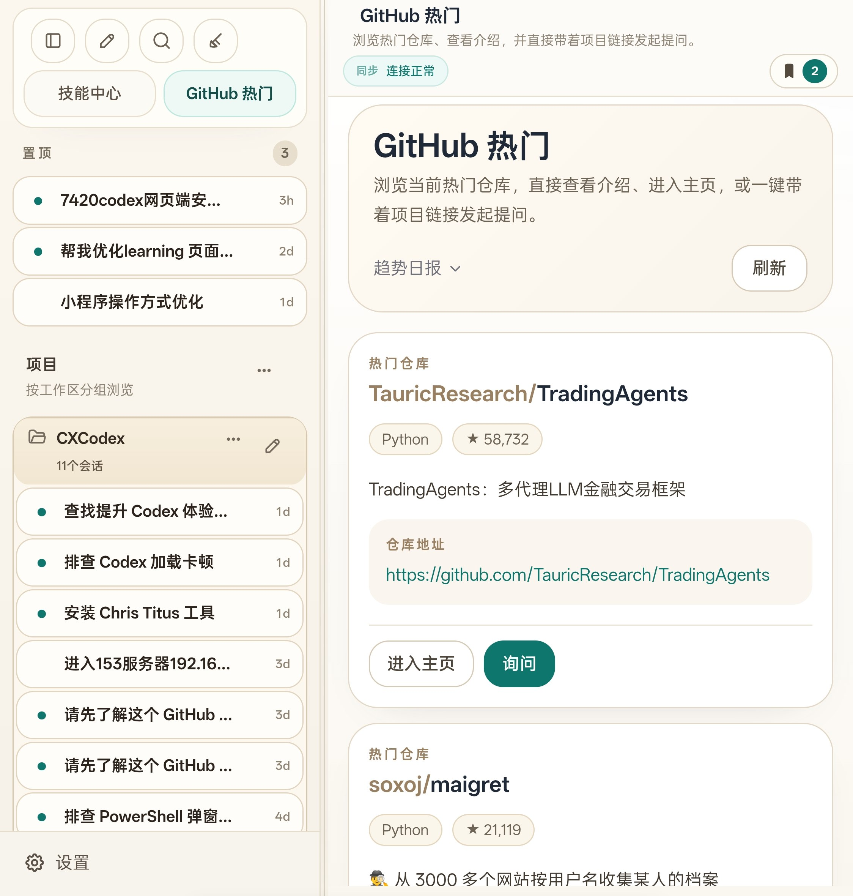

# codexui-server-bridge

Self-hosted OpenAI Codex Web UI and Android client bridge.

把本机 Codex 变成可从浏览器、手机和远程入口访问的稳定工作台。重点面向 Windows / Windows Server、Android、局域网、自托管远程访问和长期日常使用。

> 截图使用浏览器渲染的脱敏演示数据，不包含真实账号、真实路径、密钥、公网地址或私人会话内容。


## 核心卖点

- 本机 Codex 浏览器入口：复用本机 Codex、项目目录和登录态，不重建复杂云端账号体系。
- Android / 手机友好：支持移动端连接地址持久化、密钥持久化、无感重登、前台恢复补同步。
- 状态更可靠：减少任务结束后仍显示“思考中”、任务执行中无状态、线程切换慢和移动端恢复卡顿。
- Windows 友好部署：提供 Windows bootstrap、固定端口、服务脚本、发布包和常见排障文档。
- 自托管远程访问：可用于局域网、VPN、Tailscale、frp、Nginx、Caddy 或 Cloudflare Tunnel。
- 面向开源传播：README、Release、Topics、Issue 模板和截图围绕“Codex Web UI / Android / self-hosted / Windows”统一表达，方便 GitHub 和 AI 检索。

## 适合谁

- 想在电脑上跑 Codex，同时用手机继续查看和发送任务的人。
- 想在 Windows Server 上常驻一个 Codex Web 入口的人。
- 想把本地 Codex 通过局域网、VPN 或自托管公网入口安全访问的人。
- 想要一个轻量、可维护、开源的 Codex browser bridge，而不是重型 SaaS 平台的人。

## 产品截图

Android 实机对话：



折叠屏 / 平板 GitHub 热门：



桌面工作台：


Android / 手机会话：


Android 首次连接：


GitHub 热门项目：


## 快速安装

Windows 一条命令：

```powershell
Set-ExecutionPolicy Bypass -Scope Process -Force; irm https://raw.githubusercontent.com/Qjzn/codexui-server-bridge/main/scripts/bootstrap-windows.ps1 | iex
```

安装脚本会自动完成：

- 安装或复用 Node.js
- 下载并构建项目
- 生成默认配置
- 创建启动脚本
- 尝试放通端口
- 启动 Codex Web 服务

默认本地访问：

```text
http://127.0.0.1:7420
```

## 让 Codex 自动部署

也可以把下面的提示词交给目标机器上的 Codex：

```text
打开并检查 https://github.com/Qjzn/codexui-server-bridge 这个仓库。
请在这台机器上用最简单、最稳的方式部署这个项目。

要求：
- 创建一个稳定的 Codex Web UI 服务，端口固定为 7420
- 优先使用仓库自带 bootstrap 或 setup 脚本
- 如果这台机器已经登录过 Codex，尽量复用现有登录态
- 尽量开启本机浏览器访问和局域网访问
- 如果机器允许，配置开机或登录后自动启动
- 完成后输出：本机访问地址、局域网访问地址、密码、重启命令

直接执行部署，不要只给步骤说明。
```

## Android 客户端

`CX Codex` Android 壳用于连接你自己的 Codex Web 服务。

设计原则：

- APK 默认不内置任何私人服务器地址。
- 首次启动先输入连接地址，并永久保存到设备本地。
- 输入访问密钥后永久保存，Cookie 或 token 失效时自动重登。
- App 切后台或锁屏后恢复，会主动补同步线程状态和最新消息。
- App 内链接可通过原生桥接打开。

Release 页面会发布 Android APK；如果你自己构建，请查看：

- [docs/android-shell.zh-CN.md](./docs/android-shell.zh-CN.md)

## 手动运行

```bash
npx codexapp
```

固定到 `7420`：

```powershell
npx codexapp --host 0.0.0.0 --port 7420 --no-tunnel --password "change-me"
```

配置文件优先级：

1. `--config <path>`
2. `CODEXUI_CONFIG`
3. `./codexui.config.json`
4. `~/.codexui/config.json`

示例配置：

```json
{
  "host": "0.0.0.0",
  "port": 7420,
  "password": "replace-with-your-password",
  "tunnel": false,
  "open": false,
  "projectPath": "C:\\Users\\your-user\\Documents\\Playground"
}
```

## 远程访问

本项目不强绑定某一种公网方案。推荐路径：

- 局域网：直接访问服务器 IP 和端口。
- 私有网络：Tailscale / ZeroTier。
- 自有公网：Nginx / Caddy / frp。
- 临时公网：Cloudflare Tunnel。

Cloudflare Tunnel 一条命令：

```powershell
& ([scriptblock]::Create((irm 'https://raw.githubusercontent.com/Qjzn/codexui-server-bridge/main/scripts/bootstrap-windows.ps1'))) -EnableCloudflareTunnel
```

长期固定域名请看：

- [docs/cloudflare-tunnel.zh-CN.md](./docs/cloudflare-tunnel.zh-CN.md)

## 功能清单

- Codex Web UI browser bridge
- Android CX Codex client shell
- 移动端恢复补同步
- 线程列表、会话内容、执行状态和停止状态展示
- 消息收藏、置顶、复制和跳转
- 本地文件链接和图片预览
- GitHub 热门项目模块
- MCP / 工具权限控制
- Windows bootstrap 和发布包
- 健康检查、回归脚本和浸泡脚本

## 项目边界

这个项目不是官方 Codex 替代品，也不是多用户 SaaS。当前优先级是：

1. 本地 Codex 浏览器入口稳定。
2. Android / 手机体验接近桌面端。
3. Windows / Windows Server 部署省事。
4. 自托管远程访问可诊断、可维护。

## 文档

- 中文兼容页: [README.zh-CN.md](./README.zh-CN.md)
- 更新日志: [docs/changelog.zh-CN.md](./docs/changelog.zh-CN.md)
- 发版说明: [RELEASE.md](./RELEASE.md)
- 路线图: [docs/roadmap.zh-CN.md](./docs/roadmap.zh-CN.md)
- 运营规划: [docs/operations-plan.zh-CN.md](./docs/operations-plan.zh-CN.md)
- GitHub 包装文案包: [docs/github-launch-kit.zh-CN.md](./docs/github-launch-kit.zh-CN.md)
- Release 模板: [docs/release-template.zh-CN.md](./docs/release-template.zh-CN.md)
- Android 壳: [docs/android-shell.zh-CN.md](./docs/android-shell.zh-CN.md)
- Windows Server 安装: [docs/windows-server.md](./docs/windows-server.md)
- Cloudflare Tunnel: [docs/cloudflare-tunnel.zh-CN.md](./docs/cloudflare-tunnel.zh-CN.md)
- 贡献指南: [CONTRIBUTING.md](./CONTRIBUTING.md)
- 安全策略: [SECURITY.md](./SECURITY.md)

## GitHub 搜索关键词

OpenAI Codex Web UI, Codex Android client, self-hosted Codex, Codex browser bridge, Codex remote access, Windows Codex UI, mobile Codex, local Codex web, AI coding agent UI, Cloudflare Tunnel Codex, Tailscale Codex, frp Codex.

## 反馈与贡献

- 安装部署问题请使用 `Install` Issue 模板。
- 稳定性、同步、手机端体验问题请使用 `Bug` Issue 模板。
- 新能力建议请使用 `Feature` Issue 模板。
- 提交截图、日志或配置前，请先脱敏密码、Token、Cookie、真实公网地址和个人目录。
